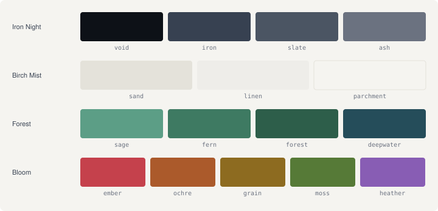

# Farn

[](https://github.com/jabopiti/farn-theme/actions/workflows/ci.yml)
[](LICENSE)
[](https://github.com/jabopiti/farn-theme/releases)

A design system rooted in the forests of northern Germany. Inspired by [Nord Theme](https://nordtheme.com).

## Sharp. *Warm.* Intellectual.

Farn is a zero-dependency, pure CSS design token library for projects that want a calm, intellectual aesthetic without a JavaScript framework. Drop in a single `<link>` tag and you get a complete two-layer token system: raw palette tokens for flexibility, semantic tokens for consistent theming across dark and light modes.

**Documentation:** [farn.jbpt.de](https://farn.jbpt.de) &nbsp;·&nbsp; **Changelog:** [CHANGELOG.md](CHANGELOG.md)

---



---

## Install

**npm / pnpm / yarn**

```sh
npm install farn-theme
```

Then import in your bundler entry (Vite, webpack, Parcel, etc.):

```css
@import "farn-theme";             /* full bundle: tokens + base reset */
@import "farn-theme/tokens";      /* tokens only — no reset */
@import "farn-theme/components";  /* opt-in component classes */
```

**CDN (no build step)**

```html
<!-- Full bundle: tokens + base reset -->
<link rel="stylesheet"
  href="https://cdn.jsdelivr.net/gh/jabopiti/farn-theme@0.1.0/dist/farn.css">
```

If you manage your own CSS reset, use the tokens-only bundle:

```html
<!-- Tokens only: no base reset -->
<link rel="stylesheet"
  href="https://cdn.jsdelivr.net/gh/jabopiti/farn-theme@0.1.0/dist/farn-tokens.css">
```

> **Version tip:** Replace `0.1.0` with the [latest release tag](https://github.com/jabopiti/farn-theme/releases) to stay current, or pin to a specific version for stability.

Prevent flash of wrong theme by adding this script before `<body>`:

```html
<script>
  (function() {
    const stored = localStorage.getItem('farn-theme');
    const system = window.matchMedia('(prefers-color-scheme: dark)').matches
      ? 'dark' : 'light';
    document.documentElement.setAttribute('data-theme', stored ?? system);
  })();
</script>
```

Then use the tokens:

```css
.my-component {
  background: var(--color-bg);
  color: var(--color-text);
  border: 1px solid var(--color-border);
}

.my-cta {
  background: var(--fo1-fern);
  color: var(--bm2-birch);
  font-family: var(--font-body);
}
```

---

## Token overview

### Palette tokens (raw — use sparingly)

| Palette | Prefix | Tokens | Use for |
|---|---|---|---|
| Iron Night | `--in*` | void, iron, slate, ash | Dark surfaces, borders |
| Birch Mist | `--bm*` | sand, mist, birch | Light surfaces, text on dark |
| Forest | `--fo*` | sage, fern, forest, deepwater | Accents, CTAs, links |
| Bloom | `--bl*` | ember, ochre, grain, moss, heather | Semantic states |

### Semantic tokens (preferred for components)

| Token | Light | Dark |
|---|---|---|
| `--color-bg` | birch | void |
| `--color-bg-panel` | mist | iron |
| `--color-bg-inset` | sand | void |
| `--color-text` | void | birch |
| `--color-text-secondary` | slate | mist |
| `--color-text-tertiary` | ash | sand |
| `--color-border` | ash | slate |
| `--color-accent` | fern | fern |
| `--color-accent-hover` | forest | sage |
| `--color-accent-text` | birch | birch |
| `--color-border-strong` | iron | sand |
| `--color-border-subtle` | rgba(55,65,81,0.12) | rgba(75,85,99,0.25) |
| `--color-ghost-border` | rgba(55,65,81,0.25) | rgba(247,246,243,0.25) |
| `--color-bg-code` | deepwater | iron |
| `--color-error` | ember | ember |
| `--color-warning` | grain | grain |
| `--color-success` | moss | moss |
| `--color-on-error` | birch | birch |

### Component tokens (Tier 3)

Override these to retheme individual components without touching the semantic layer:
`--btn-p-bg`, `--btn-p-text`, `--btn-p-hover-bg`, `--btn-g-border`, `--link-color` — see `tokens/components.css` for the full list.

### Theming

Set `data-theme="dark"` or `data-theme="light"` on `<html>`. The FOWT prevention script above handles the initial state. Override depth on any element — all surfaces adapt to the current page theme automatically:

```html
<section data-surface="base">Page-level bg (resets inside deeper surfaces)</section>
<section data-surface="layer">Card/panel level — mist (light) or iron (dark)</section>
<section data-surface="overlay">Modal/dropdown level — sand (light) or slate (dark)</section>

<!-- Force a specific theme on any element -->
<section data-theme="dark">Always dark</section>
<section data-theme="dark" data-surface="layer">Dark panel regardless of page theme</section>
```

---

## Typography

| Role | Font | Weight | Notes |
|---|---|---|---|
| Display / H1 | Fraunces | 800 | `font-variation-settings: 'opsz' 72` required |
| H2 | Fraunces | 700 | `'opsz' 24` |
| H3 | Fraunces | 600 | `'opsz' 20` |
| Body | Instrument Sans | 400 | 16px, line-height 1.7 |
| UI / metadata | Instrument Sans | 500–600 | 11–14px |
| Code | JetBrains Mono | 400–500 | 12–13px |

**Important:** Fraunces is a variable font and requires `font-variation-settings: 'opsz' <size>` to render correctly. Without it the optical sizing axis defaults to a value that may not match the intended weight.

---

## Motion

| Token | Value | Use |
|---|---|---|
| `--duration-fast` | 80ms | Press / active states |
| `--duration-base` | 120ms | Standard hover interactions |
| `--duration-slow` | 200ms | Fill, colour, indicator transitions |
| `--duration-enter` | 250ms | Drawers, nav hide/show |
| `--duration-reveal` | 400ms | Content reveal, stagger |
| `--ease-default` | ease | General transitions |
| `--ease-out` | ease-out | Exit transitions |
| `--ease-spring` | cubic-bezier(0.16,1,0.3,1) | Overshoot / spring |

---

## Spacing scale

| Token | Value |
|---|---|
| `--space-xs` | 6px |
| `--space-sm` | 12px |
| `--space-md` | 24px |
| `--space-lg` | 36px |
| `--space-xl` | 48px |
| `--space-2xl` | 60px |
| `--space-3xl` | 72px |
| `--space-4xl` | 96px |

### Layout widths

| Token | Value |
|---|---|
| `--width-content` | 1080px |
| `--width-prose` | 70ch |
| `--width-narrow` | 640px |

---

Farn uses [CSS custom properties](https://caniuse.com/css-variables) — supported in all modern browsers (Chrome 49+, Firefox 31+, Safari 9.1+, Edge 16+). No build step required.

---

## Accessibility

All semantic pairings meet WCAG 2.1 AA. Key pairs:

| Pair | Ratio | |
|---|---|---|
| `--bm2-birch` on `--in0-void` | 17.51:1 | AAA |
| `--fo1-fern` on `--bm2-birch` | 4.67:1 | AA |

[Full contrast matrix →](https://farn.jbpt.de)

---

## License

MIT — see [LICENSE](LICENSE).

Design by [Jacob Lueg Tiedemann](https://jbpt.de).
